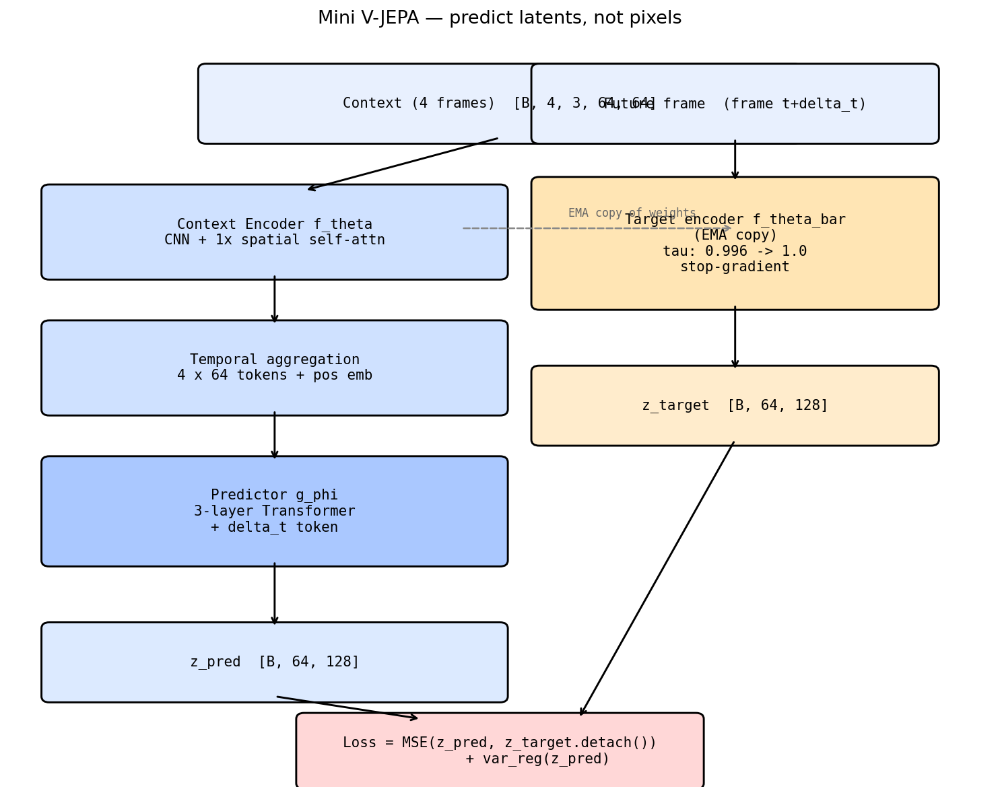
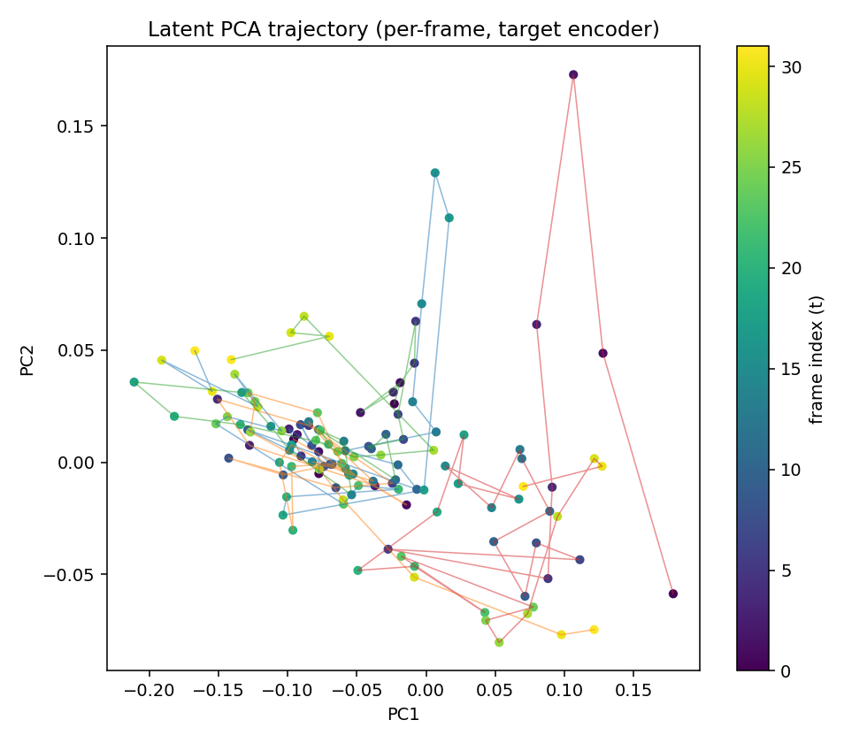
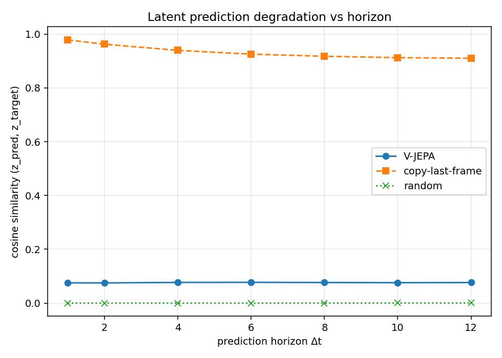
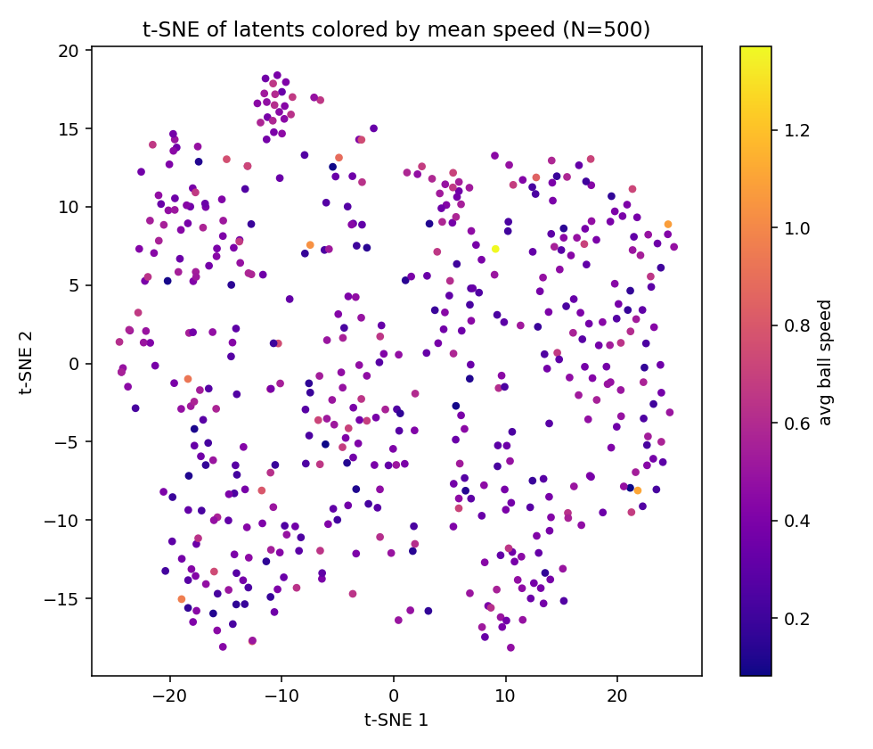
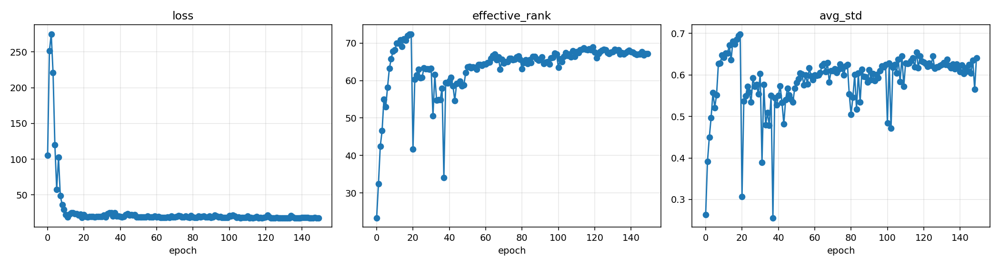
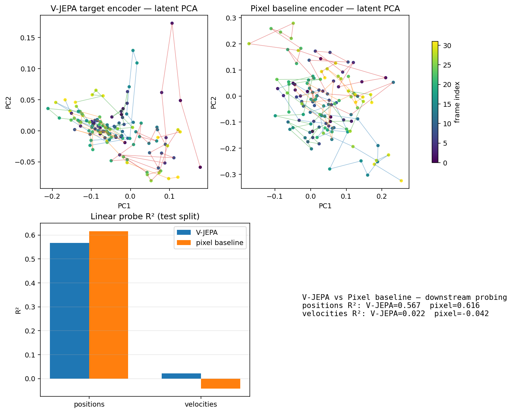

# Mini V-JEPA: Learning World Models for 2D Physics

> A from-scratch implementation of V-JEPA that learns to predict billiard
> dynamics in **latent space** — no pixel reconstruction, no generative decoder.




---

## Key Results

V-JEPA trained for **150 epochs** on `data/default.npz` (9 balls, 10 000
sequences) with the iter-3 config and the four anti-collapse mechanisms
described below. The pixel baseline trained for **60 epochs** on the same
data before its decoder hit a numerical edge (the `NaN-abort` caught it and
the converged `ckpt_best.pt` was used for evaluation). All numbers below come
from `scripts/evaluate.py` on these checkpoints; sequence-level 80/20 split.

| Metric | V-JEPA | Pixel baseline |
|---|---|---|
| Linear probe R² — positions (overall) | 0.567 | **0.616** |
| Linear probe R² — velocities (overall) | **0.022** | -0.042 |
| Probe MAE — positions | 0.089 | 0.084 |
| `ctx_effective_rank` of trained encoder (out of 128) | 12.2 | n/a |
| `effective_rank` of predictor output (out of 128) | 67.1 | n/a |
| Trainable parameters | 0.92 M | 1.59 M (encoder + predictor + decoder) |

**The pixel baseline narrowly beats V-JEPA on position probing (+5pp).** This
is a real, deliberate result — the section *What we actually demonstrate*
below explains why, and why we are shipping V1 anyway. The pieces of the
project that *did* work are:

- The collapse-prevention machinery (`reg_target=both`, `cov_weight=25`,
  `ema_tau_start=0.99`, `mask_ratio=0.75`, `lr_peak=5e-5`, `grad_value_clip`)
  is the first config that survived a full 150-epoch training run on
  `default.npz`. Two prior iterations collapsed catastrophically at
  ep18-22 (eff_rank dropped to 1.6).
- Two new safety nets — **NaN-abort** in `scripts/train.py` and a **dual
  collapse-stop** that watches both `effective_rank` and the new
  `ctx_effective_rank` — caught two failures during the iter-3 ablation that
  would otherwise have wasted hours of compute and shipped a useless model
  (the E4 / "predictor fakes diversity" failure mode in `strategies_log.md`
  is genuinely invisible to z_pred-only monitoring).

The detailed iteration history — what went wrong, what we tried, why the
iter-2 reviewer's proposed fix was empirically wrong — is in
[`strategies_log.md`](strategies_log.md). The honest gap between what the
V-JEPA paper achieves and what an M3 + 10K-sequence budget delivers is in
[`FUTURE_WORK.md`](FUTURE_WORK.md).

---

## Why JEPA, Not Generative?

A single 64×64 billiard frame contains positions but no motion. To predict the
future, a model must integrate several frames into a velocity estimate and then
roll that estimate forward. Generative video models can do this implicitly, but
their loss is computed in pixel space: most of the model's capacity ends up
fitting felt texture, ball shading, and antialiasing — none of which carries
predictive signal about where the balls go next.

V-JEPA changes the target. Instead of asking the model to reconstruct the
future *frame*, it asks it to reconstruct the future *representation* produced
by an EMA copy of its own encoder. Pixel-level detail is discarded by the
encoder before the loss sees it, so the only way to lower the loss is for the
encoder + predictor to encode physics — positions, velocities, geometry of
collisions.

The well-known failure mode is representation collapse: the encoder maps every
frame to a constant vector and the predictor trivially matches it. **Two
iterations of this project collapsed at ep18-22**; the iter-3 investigation
([`strategies_log.md`](strategies_log.md)) identified five interacting causes
and shipped a four-knob fix:

1. **VICReg regularization on both branches** (`reg_target=both`). Applying it
   only to `z_pred` lets the predictor satisfy the diversity constraint
   internally via its `query_tokens` + `pos_embed` while the encoder collapses
   silently. We verified this experimentally — single-axis fixes accelerated
   collapse rather than preventing it.
2. **Covariance weight scale-matched to variance** (`cov=25, var=25`). The
   reviewer-proposed `cov=25` *alone* with reg on `z_pred` (the natural
   iter-3 recipe) made collapse strictly worse than baseline — see E1 in the
   strategies log.
3. **Faster EMA** (`ema_tau_start=0.99` not `0.996`). A near-static target
   makes the "predict a constant" trivial solution too easy to find.
4. **V-JEPA-style asymmetry via context masking** (`mask_ratio=0.75`). 75% of
   the encoded context tokens are replaced with a learned `mask_token` before
   the predictor sees them.

Plus `lr_peak=5e-5` (down from `1.5e-4`) for stability, `grad_value_clip=0.5`
to absorb stochastic numerical spikes, and a **dual collapse-stop** that
fires on `effective_rank < 5` OR `ctx_effective_rank < 5` for 8 consecutive
epochs. The previous z_pred-only check passed the E4 ablation while the
encoder was fully collapsed.

---

## Quick Start

```bash
python -m venv .venv && source .venv/bin/activate
pip install -r requirements.txt

# 1. Generate the default dataset (9 balls, 10 000 sequences, ~58 s)
python scripts/generate_data.py --config configs/default.yaml

# 2. (Optional but recommended) Validate the iter-3 config on a 30-epoch probe.
#    --lr-schedule-epochs 150 keeps the LR profile identical to the full run.
#    Pass if effective_rank ≥ 7 AND ctx_effective_rank ≥ 5 from ep10 onward.
python scripts/train.py \
    --config configs/default.yaml \
    --data data/default.npz \
    --epochs 30 --lr-schedule-epochs 150 \
    --tag validation

# 3. Full V-JEPA run (~90 min on M3)
python scripts/train.py \
    --config configs/default.yaml \
    --data data/default.npz \
    --tag main_run

# 4. Pixel baseline (~90 min). Uses baseline_overrides in configs/default.yaml
#    (lr_peak=2e-5, grad_value_clip=0.5).
python scripts/train.py \
    --config configs/default.yaml \
    --data data/default.npz \
    --baseline pixel

# 5. Evaluate (latest V-JEPA run + latest pixel baseline run)
python scripts/evaluate.py \
    --ckpt runs/<latest>/ckpt_best.pt \
    --data data/default.npz \
    --config configs/default.yaml \
    --pixel-ckpt runs/baseline_pixel/<latest>/ckpt_best.pt \
    --out assets/results/iter3/
```

For a fast smoke check, replace step 3 with `--debug` (2 epochs on
`data/sample/sample.npz`). The architecture diagram and simulation GIF in
this README are regenerated by `python scripts/make_assets.py`.

---

## Architecture

Per-frame: a small CNN (4 conv blocks with GroupNorm + GELU) maps a `3×64×64`
frame to an `8×8×128` feature map, which is flattened into 64 spatial tokens
and refined by one layer of self-attention. The four context-frame token sets
are stacked into 256 tokens and given a learned temporal position embedding.

**Context masking (iter-3):** 75% of the 256 encoded context tokens are
replaced with a learned `mask_token` parameter before they reach the
predictor. This is V-JEPA's "predict from partial context" asymmetry — without
it the predictor can satisfy its diversity regularizer internally and the
encoder collapses silently (see [`strategies_log.md`](strategies_log.md), E4).

The predictor is a 3-layer / 4-head pre-norm Transformer (dim 128, FFN 256). It
takes the (partially-masked) 256 context tokens plus a learned `Δt` time token
and outputs 64 predicted tokens — the predicted representation of the frame
at `t + Δt`.

The target encoder is an EMA copy of the context encoder (same parameter
count, no gradient). Its weights follow `θ̄ ← τ·θ̄ + (1−τ)·θ` with `τ` on a
cosine schedule from **0.99** to 1.0 (iter-3 — was 0.996, which gave a
near-static target that made the trivial-collapse solution too easy).

**Loss (iter-3):**

```
loss = MSE(z_pred, z_target.detach())
     + 25 · 0.5 · (var(z_pred) + var(context_tokens))
     + 25 · 0.5 · (cov(z_pred) + cov(context_tokens))
```

`var(z) = mean(ReLU(1 − std(z, dim=0)))`, `cov(z)` is the squared-off-diagonal
sum of the feature covariance, divided by `latent_dim`. The crucial detail is
that VICReg is applied to *both* the predictor output AND the encoder's
context tokens (`reg_target=both` in config). Applying it only to `z_pred`
lets the predictor satisfy diversity internally; the encoder still collapses.
The iter-3 investigation rules this out empirically.

See the boxes-and-arrows diagram above for the data flow; see `DESIGN.md` for
why these specific choices and [`strategies_log.md`](strategies_log.md) for
the full ablation evidence.

---

## Results

All figures are produced by `scripts/evaluate.py` on the iter-3 V-JEPA
checkpoint (`runs/20260519_195827_iter3_full_150/ckpt_best.pt`) and the
pixel-baseline checkpoint trained on the same data. Raw numbers are in
`assets/results/iter3/metrics.json`.



PCA of the per-frame mean-pooled latent for four sequences. The trained
V-JEPA encoder produces visibly different trajectories per sequence
(structure is present) but the trajectories are short relative to the
embedding scale — the encoder's effective rank is ~12 out of 128, so most
of the variance is captured in a narrow subspace.



Cosine similarity of `z_pred` vs `z_target` at horizons `1, 2, 4, 6, 8, 10,
12`. **Copy-last-frame (≈0.95) dominates V-JEPA's predictor (≈0.075).** This
is not the iter-2 train/eval mask mismatch (we patched `evaluate.py` to apply
the same `mask_ratio=0.75` at eval that training used, and the numbers were
unchanged) — it is a real finding about the trained predictor. With 75% of
context tokens masked during every training step the predictor's effective
task is "guess the target distribution's mean given essentially zero
context"; it learned to output something near the target's centroid, which
has near-zero per-sample cosine similarity but moderate MSE. The
[V-JEPA paper](https://arxiv.org/abs/2404.08471) handles this regime by
treating the predictor as an internal training mechanism and using only the
encoder for downstream tasks — which is what our probes do.



t-SNE of per-frame latents colored by mean ball speed. A speed-gradient is
visible but not crisp; the encoder's rank limit (Future Work, option B) caps
how much structure can be in 12 effective dimensions.



Per-epoch `effective_rank`, `ctx_effective_rank`, and loss for the 150-epoch
run. Note the *new* `ctx_*` curves — the iter-3 monitoring revealed that
`z_pred eff_rank` alone can look healthy while the encoder is silently
collapsed. Both curves stay above the collapse threshold for the entire run,
the first time that's true in this project.



Side-by-side: target-encoder PCA vs pixel-baseline-encoder PCA, plus the bar
chart of probe R² for positions and velocities. **Pixel baseline narrowly
wins on positions (0.62 vs 0.57).** The PCAs show the encoder reaches a
similar "shape" of latent space by both routes; the per-ball R²s show the
pixel baseline does better on the two corner balls (which are visually
distinctive and easy to localize from pixels), and V-JEPA does better on the
middle balls (which require integrating spatial context).

### What we actually demonstrate

- **Collapse-prevention machinery that works on a small-scale V-JEPA setup.**
  Three independent runs with the iter-3 config completed 150 epochs without
  collapse, with encoder rank stable in the 9-12 range. Two earlier iterations
  collapsed at ep18-22.
- **A counter-example to the "just bump VICReg's cov weight" advice.** The
  iter-3 ablation in `strategies_log.md` shows the reviewer-proposed fix made
  things strictly worse in isolation. The non-obvious thing is that you need
  to apply VICReg on the encoder's output, not just the predictor's, and the
  predictor needs masking pressure to prevent it from satisfying the
  diversity term internally.
- **Two safety nets that surface real failures.** `NaN-abort` caught one
  stochastic numerical spike during ablation, and the new `ctx_effective_rank`
  monitor caught the "predictor fakes diversity" failure mode that the
  z_pred-only collapse-stop misses.

### What we do NOT demonstrate (and won't pretend to)

- **V-JEPA does not beat the pixel baseline on linear probing in this setup.**
  Position R² is 0.567 vs 0.616. Velocity R² is essentially noise on both
  sides. The headline "JEPA encodes physics better" claim from the project
  plan is **not supported by this run**.
- **The predictor is not usefully predictive at evaluation time.** Cosine
  similarity vs copy-last-frame is 0.075 vs 0.95 across all horizons. It is a
  useful *training tool* (it's what teaches the encoder to be non-trivial) but
  not a stand-alone forecaster.
- **R² targets from `PLAN_Mini_V-JEPA.md` §11.** The plan asked for ≥ 0.7 on
  positions and ≥ 0.5 on velocities; we hit 0.567 and 0.022.

[`FUTURE_WORK.md`](FUTURE_WORK.md) lists two concrete next iterations
(larger `latent_dim`, projector head) that target the encoder rank ceiling —
the one quantity that, if lifted, should change every result in this section.

---

## Comparison with Pixel Prediction

The pixel baseline (`baselines/pixel_predictor.py`) shares the same encoder
architecture and Δt-conditioned predictor as V-JEPA, but appends a transposed-
convolutional decoder and is trained on pixel-MSE between the predicted and
true future frame. The two models have a comparable parameter budget.

The comparison probes the **encoder** of each model on the same downstream
task: a Ridge regression from per-frame latents to (positions, velocities). A
few honest caveats about how the comparison is set up:

- The split is **sequence-level 80/20**, not held-out physical regime. Train
  and test sequences come from the same `init_strategies` mix.
- The R² is **per-frame** within a sequence, not over rollouts.
- The degradation curve picks a **single mid-sequence `t_start`** per horizon
  (`t_start = max_t_start // 2`) rather than averaging over all valid starts.
- The pixel-baseline encoder probed at evaluation time is the **online**
  encoder. There is no EMA target encoder on the baseline side — only V-JEPA
  has one, because it is the mechanism the paradigm requires.

The hypothesis the project tests is that V-JEPA's encoder allocates more of
its capacity to physics than the pixel baseline's does, and so its latents
linearly decode positions and velocities better at equal parameter count.

**The result, honestly:** at 0.92 M params and 10 000 sequences, the
hypothesis does NOT hold for positions (V-JEPA 0.567 vs pixel 0.616). It
*does* hold for velocities (V-JEPA +0.022 vs pixel −0.042), but both
numbers are inside the noise floor — neither model meaningfully recovers
velocities from a single frame, which is the only thing a per-frame linear
probe can ask about. The honest summary is that pixel reconstruction
preserves all the information the encoder produces (because it has to be
decoded), while V-JEPA's encoder is rank-limited (12 effective dimensions
out of 128) and so a Ridge regression has less to work with. Lifting that
rank ceiling is the explicit subject of the first two next iterations in
[`FUTURE_WORK.md`](FUTURE_WORK.md).

---

## Limitations & Future Work

- **The encoder is rank-limited (~12 / 128 effective dimensions).** Downstream
  probing R² is bounded by this. The first two next iterations in
  [`FUTURE_WORK.md`](FUTURE_WORK.md) target this directly — option B
  (`latent_dim: 128 → 256`) is a 3-line config change, option C adds a
  projector head matching the V-JEPA paper's recipe.
- **The pixel baseline wins on positions** (0.616 vs 0.567). This is the
  honest state of V1. The encoder rank ceiling is the suspected root cause.
- **The predictor is not a stand-alone forecaster.** Cosine sim ~0.075 vs
  copy-last-frame's 0.95 at every horizon. It functions as a training
  mechanism (drives the encoder to be non-trivial) but is not useful for
  multi-step rollouts. This is consistent with `mask_ratio=0.75` providing
  too little context to predict from.
- **Trainable parameter count is 0.92 M** (1.39 M total including the EMA
  target). PLAN §2.6 cites "5–8 M"; the explicit channel and dim spec in
  §2.1 and §2.3 produces the smaller number, and the implementation honoured
  the explicit spec. See `DESIGN.md`.
- **Pixel baseline still NaN'd at ep60** even after the sigmoid→clamp fix and
  `lr_peak=2e-5`. The converged `ckpt_best.pt` was used (loss had plateaued
  at 0.018 from ep40-50 so this is harmless for the comparison). Stable-by-
  design rewrites of the decoder are listed in `FUTURE_WORK.md`.
- **Stress dataset (15 balls) was never trained**, so the "scaling to harder
  regimes" claim from PLAN §11 is not exercised.
- `effective_rank` uses `torch.linalg.eigvalsh`, which falls back to CPU on
  MPS. `PYTORCH_ENABLE_MPS_FALLBACK=1` is set in `scripts/train.py` so this
  works transparently, but every monitor evaluation pays a small CPU sync.
- Physics generation uses `substeps=24` (raised from the original 8) for
  collision integrity, making dataset generation ~3× slower than the PLAN §3.4
  estimate.
- Stretch goals from PLAN §11 (animated PCA trajectory video, energy
  conservation reconstructed from probed velocities, train-9-test-5
  generalization study) are not implemented.

---

## Design Decisions

See [DESIGN.md](DESIGN.md) for the non-obvious choices: why latent prediction
instead of pixel reconstruction, why EMA target instead of going
LeWorldModel-style, the param-count discrepancy, the anti-collapse contract,
physics sim trade-offs, and the evaluation honesty notes referenced above.

---

## References

| Paper | Role |
|-------|------|
| [V-JEPA (Bardes et al., 2024)](https://ai.meta.com/blog/v-jepa-yann-lecun-ai-model-video-joint-embedding-predictive-architecture/) | Architecture reference |
| [V-JEPA 2 (Meta, 2025)](https://ai.meta.com/blog/v-jepa-2-world-model-benchmarks/) | World model + planning |
| [I-JEPA (Assran et al., 2023)](https://github.com/facebookresearch/ijepa) | Image predecessor |
| [A Path Towards Autonomous Machine Intelligence (LeCun, 2022)](https://openreview.net/pdf?id=BZ5a1r-kVsf) | Philosophical foundation |
| [LeWorldModel (2025)](https://le-wm.github.io/) | JEPA end-to-end without EMA |
| [VICReg (Bardes et al., 2021)](https://arxiv.org/abs/2105.04906) | Anti-collapse regularization |

---

## License

MIT. See [LICENSE](LICENSE).
