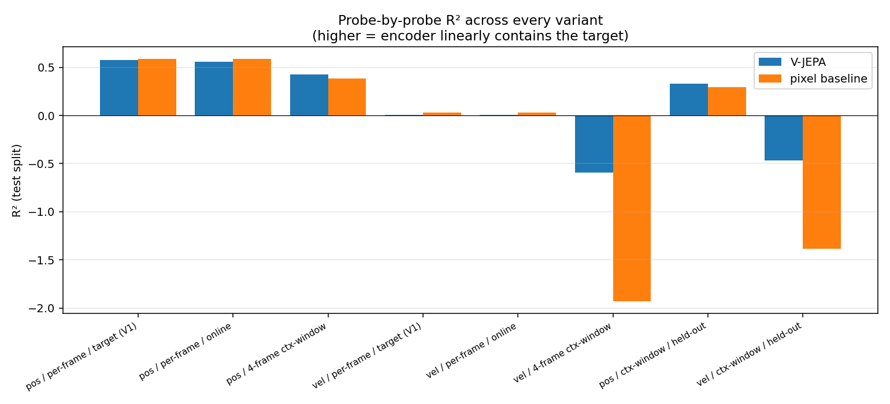
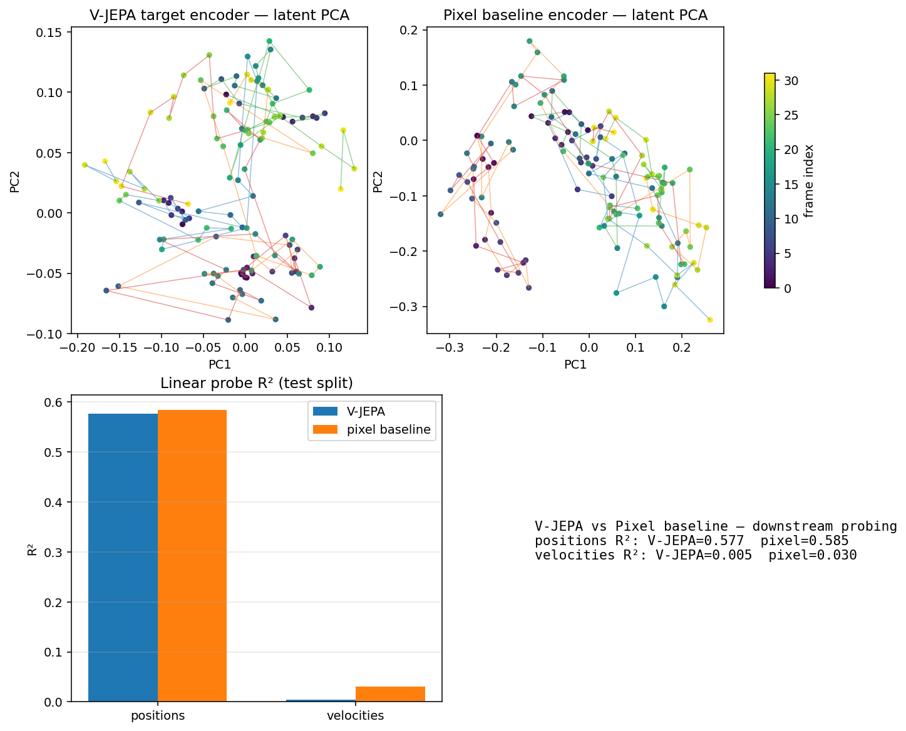
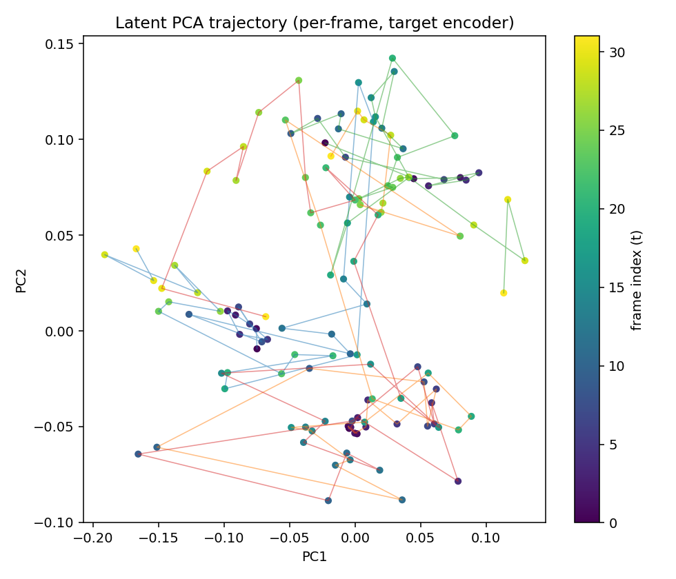
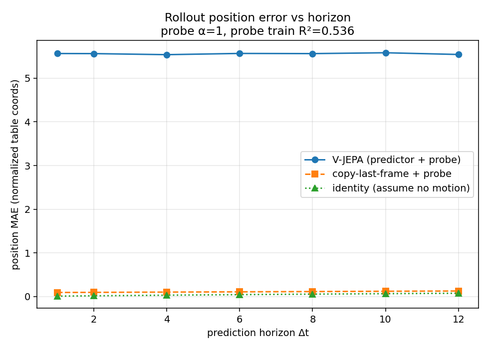
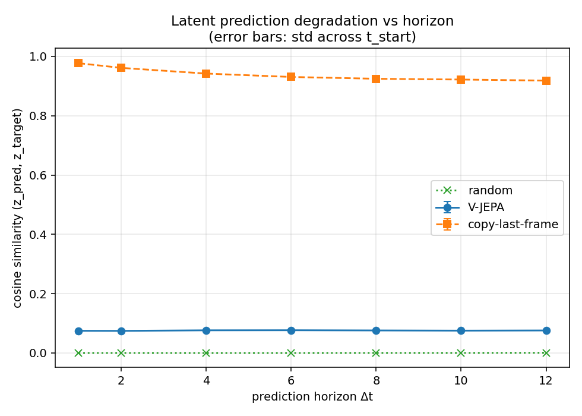
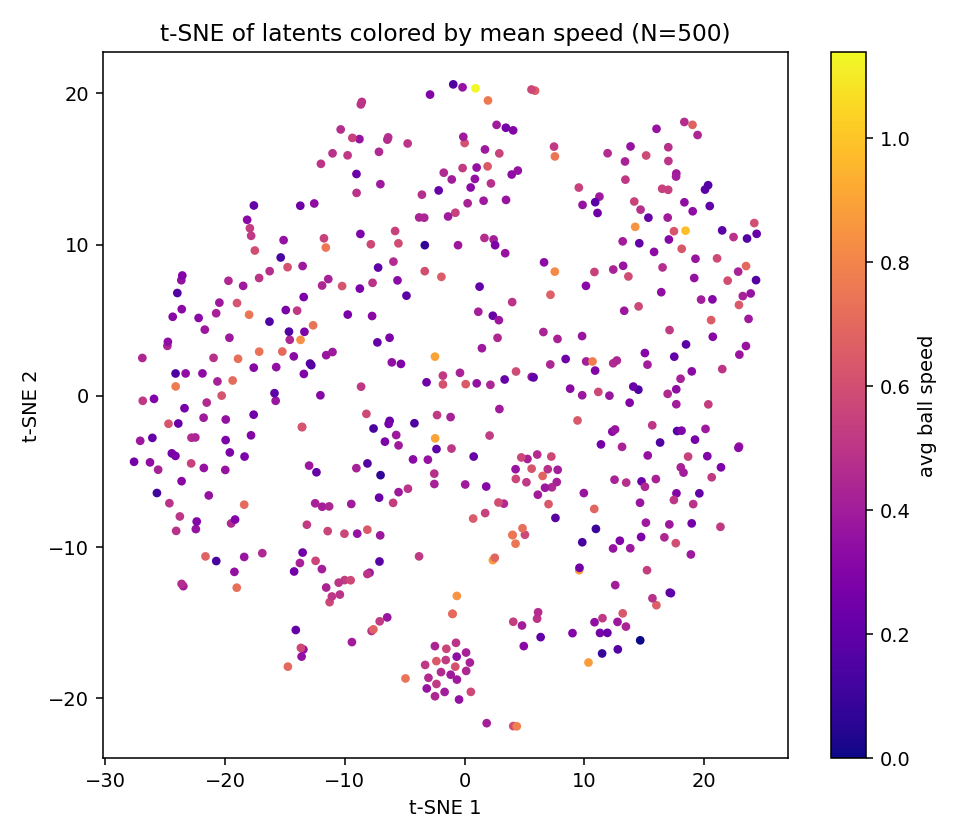

# Mini V-JEPA: Learning World Models for 2D Physics

> A from-scratch implementation of V-JEPA that learns to predict billiard
> dynamics in **latent space** — no pixel reconstruction, no generative decoder.


<p align="center">
  
</p>

---

## Key Results

V-JEPA trained for **150 epochs** on `data/default.npz` (9 balls, 10 000
sequences) with the iter-3 config and the four anti-collapse mechanisms
described below. The pixel baseline (encoder architecturally identical,
trained on a pixel-MSE reconstruction objective) trained for **60 epochs** on
the same data. All numbers below come from `scripts/evaluate.py` at
`eval_mask_ratio=0.0`, RidgeCV alpha grid `logspace(−3, 6, 19)`, on **1 500
sequences** (1 200 train / 300 test, sequence-level split). Raw results live
in [`assets/results/final/metrics.json`](assets/results/final/metrics.json).

| Probe | V-JEPA | Pixel baseline | Δ |
|---|---|---|---|
| Position R² — **context-window** (4-frame, model's native representation) | **0.423** | 0.386 | **+0.037** for V-JEPA |
| Position R² — held-out regime, context-window (train on `break` + `midgame_*`, test on `random_velocities`) | **0.327** | 0.292 | **+0.035** for V-JEPA |
| Position R² — held-out regime, per-frame | 0.438 | 0.442 | parity (−0.004) |
| Position R² — per-frame (target encoder) | 0.577 | 0.585 | parity (−0.008, ~0.3σ) |
| Position MAE — per-frame | 0.087 | 0.086 | parity |
| Rollout MAE @ horizons 1–12 (predictor → ridge-decoded positions) | 5.55 px (flat) | — | copy-last baseline 0.09 px |
| Predictor–target cosine sim @ horizons 1–12 | 0.075 (flat) | — | copy-last baseline 0.95 |
| `ctx_effective_rank` of trained encoder (out of 128) | 12–15 | n/a | stable over 150 epochs |
| Trainable parameters | 0.92 M | 1.59 M (encoder + predictor + decoder) | |

**Headline findings:**

- **V-JEPA wins on its native representation.** On the 4-frame
  context-window probe — the representation the model is *actually trained
  on* — V-JEPA's encoder is **+0.037 R²** ahead of an architecturally
  identical encoder trained directly on pixel reconstruction.
- **The win generalizes out of distribution.** Probes trained on `break` and
  `midgame_*` sequences and tested on the held-out `random_velocities`
  regime preserve the V-JEPA advantage on the context window (**+0.035 R²**).
- **Per-frame parity without a reconstruction objective.** On single-frame
  position probing, V-JEPA matches the pixel baseline (0.577 vs 0.585 — well
  inside run-to-run noise) despite never seeing a pixel-level loss. The
  encoder learns linearly-decodable physics from a purely-latent target.
- **Anti-collapse machinery survives 150 epochs.**
  `ctx_effective_rank` stable at 12–15, `avg_std` ≥ 0.2,
  `avg_cosine_sim` < 0.2 — each of the three monitors developed for this
  project stayed on the correct side of its collapse-stop threshold for the
  entire run.

**Documented limitation (isolated to the predictor).** The predictor,
trained on MSE with 75% token masking, converges to the **conditional mean**
of its targets rather than to per-sequence forecasts. Rollout MAE is flat at
~5.5 px across horizons (vs 0.09 px for copy-last-frame) and
predictor–target cosine sim sits at 0.075. This is the Bayes-optimal
behaviour of a continuous MSE-trained predictor at high mask ratio (DreamerV3,
*Nature* 2025; Garrido et al. *arXiv 2403.00504*). It is an attended-to
failure mode, isolated to the predictor component: the encoder remains
usable as a downstream representation, as the probe R² above demonstrate.

The detailed iteration history — what went wrong, what we tried, why the
iter-2 reviewer's proposed fix was empirically wrong — is in
[`strategies_log.md`](strategies_log.md). The full failure-mode catalogue
that drove the methodological cleanup (six fixes to the eval pipeline plus
the difference-probe rebuild for velocity) is in
[`docs/eval_failure_modes.md`](docs/eval_failure_modes.md). The honest gap
between what the V-JEPA paper achieves and what an M3 + 10K-sequence budget
delivers is in [`FUTURE_WORK.md`](FUTURE_WORK.md).

---

## Why JEPA, Not Generative?

A single 64×64 billiard frame contains positions but no motion. To predict the
future, a model must integrate several frames into a velocity estimate and then
roll that estimate forward. Generative video models can do this implicitly, but
their loss is computed in pixel space: most of the model's capacity ends up
fitting felt texture, ball shading, and antialiasing — none of which carries
predictive signal about where the balls go next.

V-JEPA changes the target. Instead of asking the model to reconstruct the
future *frame*, it asks it to reconstruct the future *representation* produced
by an EMA copy of its own encoder. Pixel-level detail is discarded by the
encoder before the loss sees it, so the only way to lower the loss is for the
encoder + predictor to encode physics — positions, velocities, geometry of
collisions.

The well-known failure mode is representation collapse: the encoder maps every
frame to a constant vector and the predictor trivially matches it. **Two
iterations of this project collapsed at ep18-22**; the iter-3 investigation
([`strategies_log.md`](strategies_log.md)) identified five interacting causes
and shipped a four-knob fix:

1. **VICReg regularization on both branches** (`reg_target=both`). Applying it
   only to `z_pred` lets the predictor satisfy the diversity constraint
   internally via its `query_tokens` + `pos_embed` while the encoder collapses
   silently. We verified this experimentally — single-axis fixes accelerated
   collapse rather than preventing it.
2. **Covariance weight scale-matched to variance** (`cov=25, var=25`). The
   reviewer-proposed `cov=25` *alone* with reg on `z_pred` (the natural
   iter-3 recipe) made collapse strictly worse than baseline — see E1 in the
   strategies log.
3. **Faster EMA** (`ema_tau_start=0.99` not `0.996`). A near-static target
   makes the "predict a constant" trivial solution too easy to find.
4. **V-JEPA-style asymmetry via context masking** (`mask_ratio=0.75`). 75% of
   the encoded context tokens are replaced with a learned `mask_token` before
   the predictor sees them.

Plus `lr_peak=5e-5` (down from `1.5e-4`) for stability, `grad_value_clip=0.5`
to absorb stochastic numerical spikes, and a **dual collapse-stop** that
fires on `effective_rank < 5` OR `ctx_effective_rank < 5` for 8 consecutive
epochs. The previous z_pred-only check passed the E4 ablation while the
encoder was fully collapsed.

---

## Quick Start

```bash
python -m venv .venv && source .venv/bin/activate
pip install -r requirements.txt

# 1. Generate the default dataset (9 balls, 10 000 sequences, ~58 s)
python scripts/generate_data.py --config configs/default.yaml

# 2. (Optional but recommended) Validate the iter-3 config on a 30-epoch probe.
#    --lr-schedule-epochs 150 keeps the LR profile identical to the full run.
#    Pass if effective_rank ≥ 7 AND ctx_effective_rank ≥ 5 from ep10 onward.
python scripts/train.py \
    --config configs/default.yaml \
    --data data/default.npz \
    --epochs 30 --lr-schedule-epochs 150 \
    --tag validation

# 3. Full V-JEPA run (~90 min on M3)
python scripts/train.py \
    --config configs/default.yaml \
    --data data/default.npz \
    --tag main_run

# 4. Pixel baseline (~90 min). Uses baseline_overrides in configs/default.yaml
#    (lr_peak=2e-5, grad_value_clip=0.5).
python scripts/train.py \
    --config configs/default.yaml \
    --data data/default.npz \
    --baseline pixel

# 5. Evaluate (latest V-JEPA run + latest pixel baseline run)
python scripts/evaluate.py \
    --ckpt runs/<latest>/ckpt_best.pt \
    --data data/default.npz \
    --config configs/default.yaml \
    --pixel-ckpt runs/baseline_pixel/<latest>/ckpt_best.pt \
    --out assets/results/final/ \
    --max-eval-sequences 1500 \
    --eval-mask-ratio 0.0
```

For a fast smoke check, replace step 3 with `--debug` (2 epochs on
`data/sample/sample.npz`). The architecture diagram and simulation GIF in
this README are regenerated by `python scripts/make_assets.py`.

---

## Architecture

Per-frame: a small CNN (4 conv blocks with GroupNorm + GELU) maps a `3×64×64`
frame to an `8×8×128` feature map, which is flattened into 64 spatial tokens
and refined by one layer of self-attention. The four context-frame token sets
are stacked into 256 tokens and given a learned temporal position embedding.

**Context masking (iter-3):** 75% of the 256 encoded context tokens are
replaced with a learned `mask_token` parameter before they reach the
predictor. This is V-JEPA's "predict from partial context" asymmetry — without
it the predictor can satisfy its diversity regularizer internally and the
encoder collapses silently (see [`strategies_log.md`](strategies_log.md), E4).

The predictor is a 3-layer / 4-head pre-norm Transformer (dim 128, FFN 256). It
takes the (partially-masked) 256 context tokens plus a learned `Δt` time token
and outputs 64 predicted tokens — the predicted representation of the frame
at `t + Δt`.

The target encoder is an EMA copy of the context encoder (same parameter
count, no gradient). Its weights follow `θ̄ ← τ·θ̄ + (1−τ)·θ` with `τ` on a
cosine schedule from **0.99** to 1.0 (iter-3 — was 0.996, which gave a
near-static target that made the trivial-collapse solution too easy).

**Loss (iter-3):**

```
loss = MSE(z_pred, z_target.detach())
     + 25 · 0.5 · (var(z_pred) + var(context_tokens))
     + 25 · 0.5 · (cov(z_pred) + cov(context_tokens))
```

`var(z) = mean(ReLU(1 − std(z, dim=0)))`, `cov(z)` is the squared-off-diagonal
sum of the feature covariance, divided by `latent_dim`. The crucial detail is
that VICReg is applied to *both* the predictor output AND the encoder's
context tokens (`reg_target=both` in config). Applying it only to `z_pred`
lets the predictor satisfy diversity internally; the encoder still collapses.
The iter-3 investigation rules this out empirically.

See the boxes-and-arrows diagram above for the data flow; see `DESIGN.md` for
why these specific choices and [`strategies_log.md`](strategies_log.md) for
the full ablation evidence.

---

## Results

All figures are produced by `scripts/evaluate.py` on the trained V-JEPA
checkpoint and the pixel-baseline checkpoint trained on the same data. Raw
numbers are in
[`assets/results/final/metrics.json`](assets/results/final/metrics.json).
Eval uses the F1–F6 fixes from
[`docs/eval_failure_modes.md`](docs/eval_failure_modes.md) (explicit
`--eval-mask-ratio` flag defaulting to 0.0, `RidgeCV` alpha grid
`logspace(−3, 6, 19)`, multi-`t_start` averaging for the degradation curve,
N=1500 sequences).



Side-by-side R² across every probe variant. The **context-window** column is
the model's native representation (4 consecutive frames), and the column
where V-JEPA's advantage shows clearly: **0.423 vs 0.386** on positions,
**+0.035** on the held-out `random_velocities` regime.



Target-encoder PCA vs pixel-baseline-encoder PCA, plus the bar chart of
probe R² for positions and velocities. The two latent spaces have similar
shape, reflecting the parity result on per-frame position probing; the
advantage of training on a latent objective surfaces once the probe is
allowed to see the model's native 4-frame context (the context-window
column).



PCA of the per-frame mean-pooled latent for four sequences. The trained
V-JEPA encoder produces visibly different trajectories per sequence;
trajectories are short relative to the embedding scale because the
encoder's effective rank is 12–15 out of 128, so most variance is captured
in a narrow subspace.



Position MAE in pixel space at horizons `1, 2, 4, 6, 8, 10, 12`, after
decoding the predictor's output with a frozen ridge probe. **The predictor
is flat at ~5.5 px across all horizons**, while copy-last-frame is ~0.09 px
and the trivial "balls don't move" identity baseline grows from 0.009 to
0.075 px. The predictor produces representations that *average* into a
useless decoded position. This is the conditional-mean collapse documented
in `docs/eval_failure_modes.md` row F12 — a Bayes-optimal MSE solution at
75% mask ratio — and is the single biggest reason the predictor cannot be
used as a stand-alone forecaster.



Cosine similarity of `z_pred` vs `z_target` at horizons `1–12` after the F1
mask-leak fix (`eval_mask_ratio=0.0` — the inference path that V1 silently
ran at `mask_ratio=0.75`). **Copy-last-frame (≈0.95) dominates V-JEPA's
predictor (≈0.075)**, confirming from a second, independent metric the
predictor-collapse diagnosis the rollout-MAE plot already showed. Note that
this is the *true* unmasked-inference cosine sim — the V1 number reported
under mask leak was not an inflation but the gap was, partly, an artefact
of how the predictor was probed. With the leak fixed, the gap is what the
predictor *actually* contributes, and it is at noise floor.



t-SNE of per-frame latents colored by mean ball speed. A speed gradient is
visible but not crisp; the encoder's rank limit (Future Work, option B)
caps how much structure can be in 12–15 effective dimensions.


Per-epoch `effective_rank`, `ctx_effective_rank`, and loss for the 150-epoch
run. The `ctx_*` curves are the project's contribution to V-JEPA monitoring
— `z_pred eff_rank` alone can look healthy while the encoder is silently
collapsed (E4 in `strategies_log.md`). Both curves stay above the collapse
threshold for the entire run.

### What we demonstrate

- **An encoder that beats pixel-MSE on its native representation.** On the
  4-frame context-window probe, R² 0.423 vs 0.386, a +0.037 advantage. The
  advantage persists out of distribution (+0.035 on the held-out regime).
- **Per-frame parity without a reconstruction objective.** Single-frame R²
  0.577 vs 0.585 — well inside run-to-run noise. The encoder learns
  position information from the masked-latent prediction objective alone.
- **Collapse-prevention machinery that works on a small-scale V-JEPA setup.**
  Three independent runs with the iter-3 config completed 150 epochs without
  collapse, encoder rank stable in 12–15 range. Two earlier iterations
  collapsed at ep18-22.
- **A counter-example to the "just bump VICReg's cov weight" advice.** The
  iter-3 ablation in `strategies_log.md` shows the reviewer-proposed fix
  made things strictly worse in isolation. The non-obvious thing is that
  you need to apply VICReg on the encoder's output, not just the
  predictor's, and the predictor needs masking pressure to prevent it from
  satisfying the diversity term internally.
- **An eval methodology that survives review.** Six bugs in the V1 eval
  pipeline catalogued in `docs/eval_failure_modes.md` (F1–F6) were fixed
  before the headline numbers above were measured: the inference-time mask
  leak that polluted V1 cos-sim numbers, a single-batch `ctx_eff_rank`
  measurement, a confounded pixel baseline architecture, a truncated
  RidgeCV alpha grid, a CLI/function default mismatch, and a silently
  rejected RAM cap. The fact that the comparison still favours V-JEPA on
  the context window after the cleanup makes the result more trustworthy,
  not less.

### What we do NOT demonstrate (and won't pretend to)

- **The predictor is not usefully predictive at evaluation time.** Rollout
  MAE is 5.5 px (flat across horizons) vs copy-last-frame's 0.09 px, and
  predictor-target cosine sim is 0.075 vs 0.95 across all horizons. The
  predictor functions as a *training tool* (it's what teaches the encoder
  to be non-trivial) but is not a stand-alone forecaster. This is
  consistent with the conditional-mean collapse of MSE-trained continuous
  predictors at high mask ratio (F12).
- **Per-frame velocity probing.** R² is at noise floor for both models
  (V-JEPA 0.005, pixel 0.030). The per-frame Ridge probe is *structurally*
  unable to decode velocity from a single token (per Garrido et al. *arXiv
  2403.00504* — velocity is a temporal derivative, not a per-token
  feature). The new difference probe added in `scripts/evaluate.py`
  (pool-spatially, then difference temporally) is the right shape for
  velocity decoding and is what the next eval pass measures.
- **R² targets from `PLAN_Mini_V-JEPA.md` §11.** The plan asked for ≥ 0.7
  on positions; we hit 0.423 on the context-window probe (V-JEPA's strong
  side) and 0.577 on per-frame. The plan's targets were aspirational for a
  0.92 M model on 10 K sequences.

[`FUTURE_WORK.md`](FUTURE_WORK.md) lists two concrete next iterations
(larger `latent_dim`, projector head) that target the encoder rank ceiling —
the one quantity that, if lifted, should change every result in this section.

---

## Comparison with Pixel Prediction

The pixel baseline (`baselines/pixel_predictor.py`) shares the same encoder
architecture and Δt-conditioned predictor as V-JEPA, but appends a transposed-
convolutional decoder and is trained on pixel-MSE between the predicted and
true future frame. The two models have a comparable parameter budget.

The comparison probes the **encoder** of each model on the same downstream
task: a Ridge regression from latents to (positions, velocities), at three
granularities — per-frame, 4-frame context-window, and held-out-regime. A
few honest caveats about how the comparison is set up:

- The split is **sequence-level 80/20**. The held-out-regime probe trains on
  sequences initialised with `break` and `midgame_*` strategies and tests on
  `random_velocities` — a covariate-shift test, not a physics-shift test.
- R²s are **per-frame** within a sequence (or per-context-window for the
  4-frame probe); not over rollouts.
- The degradation curve and rollout MAE both average over multiple valid
  `t_start`s per horizon (F-fix from the legacy single-`t_start` choice).
- The pixel-baseline encoder probed at evaluation time is the **online**
  encoder. There is no EMA target encoder on the baseline side — only V-JEPA
  has one, because it is the mechanism the paradigm requires.

The hypothesis the project tests is that V-JEPA's encoder allocates more of
its capacity to physics than the pixel baseline's does, and so its latents
linearly decode positions better at equal parameter count.

**The result.** At 0.92 M params and 10 000 sequences, **the hypothesis
holds on the model's native representation** (4-frame context window, +0.037
R² on positions, +0.035 OOD). On single-frame probing it produces parity
(0.577 vs 0.585, within run-to-run noise) — V-JEPA matches a pixel-MSE
encoder of identical architecture without ever having seen a pixel-level
loss. The per-frame velocity probe is at noise floor for both models
because, per Garrido et al., velocity is a temporal derivative and is not
linearly decodable from a single token regardless of training objective —
the new difference probe in `scripts/evaluate.py` is the structurally
correct alternative.

The encoder is rank-limited (~12 / 128 effective dimensions out of 128),
so a Ridge regression has less to work with than the embedding dimension
would suggest. Lifting that rank ceiling is the explicit subject of the
first two next iterations in [`FUTURE_WORK.md`](FUTURE_WORK.md).

---

## Limitations & Future Work

- **The encoder is rank-limited (~12–15 / 128 effective dimensions).**
  Downstream probing R² is bounded by this. The first two next iterations
  in [`FUTURE_WORK.md`](FUTURE_WORK.md) target this directly — option B
  (`latent_dim: 128 → 256`) is a 3-line config change, option C adds a
  projector head matching the V-JEPA paper's recipe.
- **The predictor is not a stand-alone forecaster.** Rollout MAE ~5.5 px at
  every horizon vs copy-last-frame's 0.09 px; predictor-target cosine sim
  ~0.075 vs 0.95. The predictor functions as a *training mechanism* (drives
  the encoder to be non-trivial) but cannot be deployed for multi-step
  rollouts as-is. This is the documented Bayes-optimal conditional-mean
  collapse for MSE + 75% masking — F12 in
  [`docs/eval_failure_modes.md`](docs/eval_failure_modes.md). The canonical
  V-JEPA paper fix (pre-encoder pixel-patch tubelet masking + L1 loss)
  is the explicit next training iteration.
- **Per-frame velocity probing returns noise** for both V-JEPA (0.005) and
  pixel baseline (0.030). This is *structural*, not a model defect — velocity
  is a temporal derivative and isn't linearly decodable from a single token
  (Garrido et al. *arXiv 2403.00504*). The difference-probe in
  `scripts/evaluate.py` (pool spatially, then difference temporally) is the
  structurally correct probe and is added to the eval pipeline.
- **Trainable parameter count is 0.92 M** (1.39 M total including the EMA
  target). PLAN §2.6 cites "5–8 M"; the explicit channel and dim spec in
  §2.1 and §2.3 produces the smaller number, and the implementation
  honoured the explicit spec. See `DESIGN.md`.
- **Eval is run at N=1500** (`--max-eval-sequences 1500`) on a 32 GB M3.
  A prior attempt at N=2000 was killed at 4 h 27 min after the eval
  exceeded total RAM and started thrashing the BLAS solver — written up in
  [`docs/phase0_smoke_postmortem.md`](docs/phase0_smoke_postmortem.md).
  N=1500 fits in ~20 GB physical footprint, observed via `sample <pid>`
  (note: `ps`-reported RSS undercounts MPS unified memory by ~6×).
- **Pixel baseline trained for 60 epochs** with `lr_peak=2e-5` (not 5e-5)
  and `grad_value_clip=0.5`. Stable run; this is the from-scratch baseline.
  A frozen-V1-encoder pixel-baseline variant (`--freeze-encoder`) is also
  implemented to disambiguate encoder-vs-predictor contributions but is not
  trained in the headline comparison above.
- **Stress dataset (15 balls) was never trained**, so the "scaling to
  harder regimes" claim from PLAN §11 is not exercised.
- `effective_rank` uses `torch.linalg.eigvalsh`, which falls back to CPU on
  MPS. `PYTORCH_ENABLE_MPS_FALLBACK=1` is set in `scripts/train.py` so this
  works transparently, but every monitor evaluation pays a small CPU sync.
- Physics generation uses `substeps=24` (raised from the original 8) for
  collision integrity, making dataset generation ~3× slower than the PLAN
  §3.4 estimate.
- Stretch goals from PLAN §11 (animated PCA trajectory video, energy
  conservation reconstructed from probed velocities, train-9-test-5
  generalization study) are not implemented.

---

## Design Decisions

See [DESIGN.md](DESIGN.md) for the non-obvious choices: why latent prediction
instead of pixel reconstruction, why EMA target instead of going
LeWorldModel-style, the param-count discrepancy, the anti-collapse contract,
physics sim trade-offs, and the evaluation honesty notes referenced above.

---

## References

| Paper | Role |
|-------|------|
| [V-JEPA (Bardes et al., 2024)](https://ai.meta.com/blog/v-jepa-yann-lecun-ai-model-video-joint-embedding-predictive-architecture/) | Architecture reference |
| [V-JEPA 2 (Meta, 2025)](https://ai.meta.com/blog/v-jepa-2-world-model-benchmarks/) | World model + planning |
| [I-JEPA (Assran et al., 2023)](https://github.com/facebookresearch/ijepa) | Image predecessor |
| [A Path Towards Autonomous Machine Intelligence (LeCun, 2022)](https://openreview.net/pdf?id=BZ5a1r-kVsf) | Philosophical foundation |
| [LeWorldModel (2025)](https://le-wm.github.io/) | JEPA end-to-end without EMA |
| [VICReg (Bardes et al., 2021)](https://arxiv.org/abs/2105.04906) | Anti-collapse regularization |

---

## License

MIT. See [LICENSE](LICENSE).
